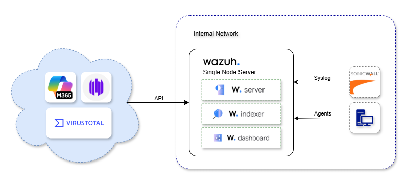

# Wazuh SIEM Deployment for SMEs (FYP)

## 🧩 Project Overview
This repository documents the deployment of **Wazuh SIEM** in a Small-to-Medium Enterprise (SME) environment as part of my Final Year Project (FYP).  
The goal is to enhance **infrastructure visibility, log management, and threat detection** using an open-source, cost-effective solution.  

- **Mode:** Single-node cluster  
- **Agents:** Windows and Ubuntu endpoints  
- **Integrations:** Microsoft 365 (O365), SentinelOne, SonicWall Firewall, VirusTotal  

---

## 🏗️ Architecture

**Components**
- Wazuh Manager  
- Wazuh Indexer  
- Wazuh Dashboard  
- Agents (Windows, Ubuntu)  
- External log integrations (O365, SentinelOne, SonicWall, VirusTotal)  

---
## ⚙️ Server Requirement 
- RAM:  16GB 
- Disk: 500GB
- CPU:  4 vCPU
---

## 📄 Documentation
👉 Full deployment steps, agent installation, integrations are available here:  
[Deployment Guide](docs/DEPLOYMENT.md)
